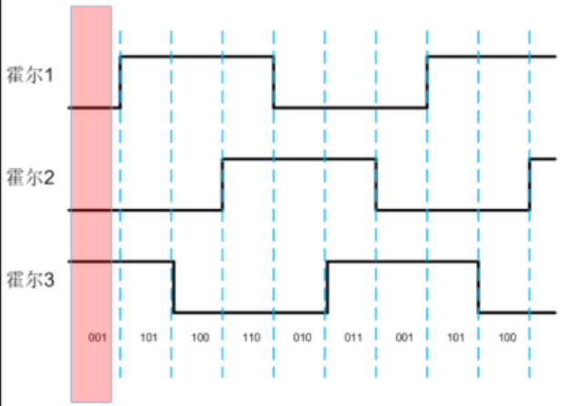

# HALL传感器原理
- 假设三个霍尔传感器成120度分布
- 输出的三相霍尔信号如下:

# 具体步骤:
1、确定真值表

- 转动电机并读取真值表
- 根据硬件的实际情况，得出真值表的顺序:
- 例如:6-4-5-1-3-2

2、确定零点

- ud=1 uq=0使电机运动到零点为止
- 读取霍尔扇区，若此时读出的3.则有如下对应关系:
`sg_hall_section[7] = {0.0f,300.0f,60.0f,330.0f,0.0f,180.0f,2400.0f,120.0f};`

3、零点和实际的偏差（偏差1）
- 根据2提供的方法，有可能，当电机处于零点时，但实际上转子位置位于0度~60度之间[霍尔扇区返回值为3]

4、ABZ编码器
- 将TIM编码器模式的重载值，设置为4096(和编码器线数一致)

5、更新霍尔值(由中断触发)
- 每触发一次霍尔值的更新，就更新一次参考值，同时清除编码器的重载值。

  