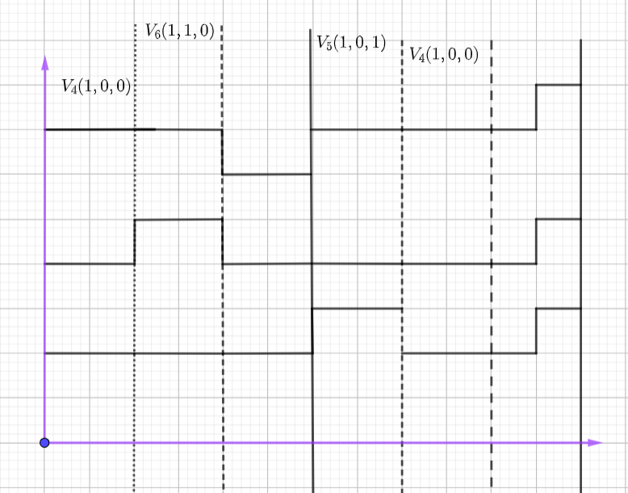

# SVPWM
通过之前的梳理，已经从宏观上解释了SVPWM的作用以及含义。
# SVPWM的推导
## 已知条件如下：
- 基矢量，$\frac{2}{3}U_{DC}$
- 周期，$T_s$
- 电源电压,$U_{DC}$
## 换相点公式推导
- $\frac{\sqrt3}{3}U_{DC}$
具体的推导过程如下：
    - 根据伏秒平衡原理有:
    \[
    \left\{
    \begin{array}{l}
    V_{ref}T_s = V_4T_4+V_6T_6+V_0T_0 \\
    T_s = T_4+T_6+T_0
    \end{array}
    \right.
    \]
    - 根据三角形正弦定理可知:
    \[
    \frac{V_{\text{ref}}}{\sin(60^\circ)} = \frac{V'_6}{\sin(\theta)} = \frac{V'_4}{\sin(60^\circ - \theta)} \quad \text{式1}
    \]
    - 对其进行化简:
    \[\frac{V_{ref}}{sin(60^\circ)}=\frac{{V'_4}}{sin(60^\circ-\theta)}\]
    其中:     
    \[\frac{V_{ref}}{sin(60^\circ)}sin(60^\circ-\theta)=V'_4\\
    V'_4代表合成参考矢量的其中一路矢量,V'_4 = \frac{T_4}{T_S}V_4\]
    - 将其代入:
    \[\frac{V_{ref}}{sin(60^\circ)}sin(60^\circ-\theta)= \frac{T_4}{T_S}V_4\]
    - 化简后:
    \[\frac{T_S\frac{V_{ref}}{sin(60^\circ)}sin(60^\circ-\theta)}{V_4}= T_4 \quad \quad (V_4=\frac{2U_{DC}}{3})\\
    T_4 = \frac{\sqrt{3}V_{ref}}{U_{DC}}T_Ssin(60^\circ-\theta)\]
    - 同理可得:
    \[T_6\]
## 开关分配
以第一扇区为例，两个基矢量分别为\(V_4(1,0,0),V_6(1,1,0)\)。其作用顺序如下:
    
由上图可知，该分配方式需要频繁的对MOS管进行开关，不合理。
合理的方式如下:


## C语言代码编写
伪代码如下:
```C
_2r_2s(uq,ud,theta,ualp,ubet);
_svpwm(ualp,ubet,float a,b,c);
```
### 扇区的判断

- $V_0$是零矢量，其大小对$V_{ref}$没有任何影响，也就是说要是$V_{ref}$最大，$T_0$应该等于0。
将$V_{ref}$分解到alpha，beta轴：
\[
\left\{
\begin{array}{l}
T_sV_{ref}*cos\theta = V_4T_4+V_6cos(60^\circ-\theta)T_6\\
T_sV_{ref}*sin\theta = V_6sin(60^\circ - \theta)T_6
\end{array}
\right.
\]
通过EXCEL表格也可观察出，若$V_{ref}>\frac{2}{3}U_{DC}$,则$T_0,T_1,T_2$有负值出现。
### 主副矢量的大小

### 换相矢量点的大小

excel表格

simulink模型

