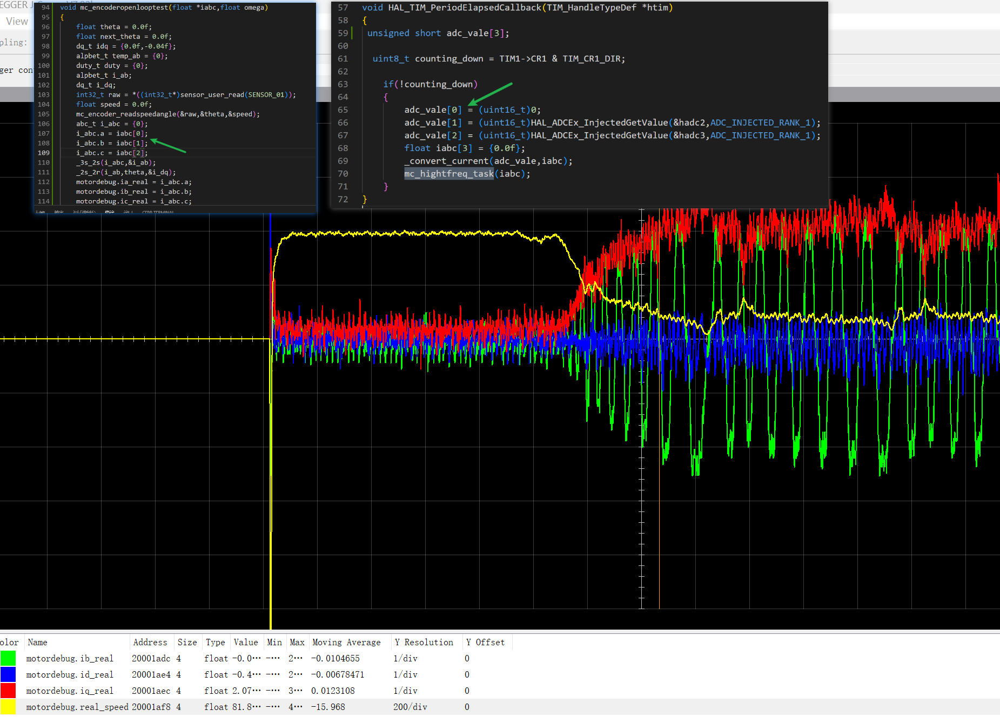

# Motorctrl模块
## 模块配置
### 对外接口
-   `motorctrl_process()函数`
-   `motorctrl_init()函数`
-   `mc_hightfreq_task(float *iabc)函数`
### 对内配置
- `__attribute__((weak)) void motor_enable(void)`
- `__attribute__((weak)) void motor_disable(void)`
- `__attribute__((weak)) void mc_param.setpwm(...)`
- `__attribute__((weak)) void _bsp_protransmit(...)`
一般情况，上面的函数放在`board.c/h`定义和声明

## 函数说明
#### mc_openloop()函数说明

##### 原理:
- 基本公式:
    - $\theta = \omega t$
    - $\omega = 2 \pi /t$
- 给定角度$2\pi$,3s旋转一圈。
- `mc_openloop()`函数被调周期周期0.000125s
- 每次角度自增为:$\theta = 2\pi/t * 0.000125 * cnt$

##### 功能:
- 可观察函数三相电流
- 编码器角度
- iq,id
### mc_encoderopenlooptest()
- 编码器开环
    - 通过使能该功能，开启该功能
- 电流调试过程
    - 用手堵转电机，`i_abc,iq,id`如下:

- 速度调试
    - 观察输出`mc_encoder_read()`函数输出角度和测速仪之间的关系
## 编码器获取速度
1. 使用`mc_encoderopenlooptest()`函数，给定`Ud=0,Uq=0.8`
2. 电机转动，使用测速器测试当前转速`300ramp`
3. 读取编码器输出速度，观察该值和实际转速之间的关系
### 编码器测速原理
- 转速和角速度之间的关系$2\pi*n = \omega*60 $
    - $ n = \frac{60}{2\pi}\omega$
- 角速与电流环频率的关系
    - 当电流环的频率为f，也就是说每$T = \frac{1}{f}$会进一次中断，更新一次角度值。
    - 若一个周期$T$转过的角度为$\theta$度，对应的角速度为$\omega = \frac{\theta}{T} = \theta*f$
- 转速和角度之间的关系
    - $n = \frac{60}{2\pi}*\theta*f$
    - $\theta = \frac{2\pi}{60f}*n$ 
- 例如:
    当电流环频率为10KHz,电机转速10000ramp。此时每个电流周期，转子转过的角度:
        $\theta = \frac{2\pi}{60*10000}*10000 = 1.04719753(rad) = 5.7(度)$
- 速度环频率的选取
    1.假设速度环周期为$t_1$
    
    2.在绝对值编码器下，两次角度的差值应在$2\pi$内。
    
    3.可以选取一个中间值$[\frac{\pi}{2},\frac{3\pi}{2}]$
    
    4.以$\pi/2$为例，当电机在$t_1$内转过$\pi/2$。那么电机的角速度为:$\frac{\pi}{2t_1}$,
    其对应的转速为:$n = \frac{60}{2\pi}*(\frac{\pi}{2t_1})$
    - 若$t_1 = 2ms$,则对应的转速$n = \frac{60}{2\pi}*(\frac{\pi}{2*0.002}) = 7500(ramp)$ 

    5.同理可以计算出
    - 若$t_1 = 2ms$,则对应的转速$n = \frac{60}{2\pi}*(\frac{3\pi}{2*0.002}) = 22500(ramp)$

    6.综上所述。当选择速度环周期为2ms，适用的电机转速尽可能不超过22500(ramp)
## MCU模拟正弦波
- 函数`void sin_task1(void)`
```C
/**
 * 被调频率:f = 1000Hz T=0.001s 
 */
void sin_task1(void)
{
    float delt,y;
    static float x;
    y = sin(x);
    x += delt; 
}
```
- 计算过程
    - 正弦波一个周期是:T_s
    - $\frac{2\pi}{delt}*T = T_s$ 
    - $delt = \frac{2\pi T}{T_s}=2\pi T \omega$
    - $\omega = \frac{delt}{2\pi T}$
## 电机协议
### 串口波特率:`2000000bit/s=200KHZByte/s   10bit(1bit起始位+8bit数据位+1停止位)=1Byte`
- 传输`1Byte`需要`5us`
- 100us传输`20Byte` 1ms传输`200Byte` 2ms传输`400Byte`   100us(10kHz) 1ms(1KHz) 2ms(500Hz)
- 电机转速3000rap/min，电流频率3000/60*p=350HZ
- 当1KHz频率采样电流频率，完全够用

## MotorCtrl模块调试
### 版本:`git reset --hard cdaedfd`
### `D轴电流`调试步骤:
- 使用mcom助手,下拉列表选择<设置PID参数>,填写kp,ki,kc,max,min(kc,max,min随意，代码已固定)数值。点击<确认>
- 控制器自动重启
- 进入debug模式
- 启动电机
- 下拉列表选择<设置PID目标>，填写文本框具体数据即可，确认，观察j-scop。