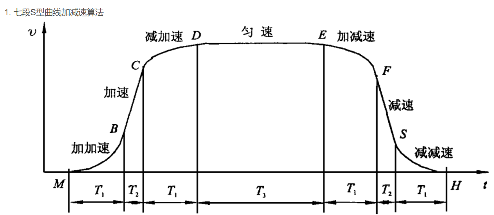

# S型加减速


$
v_1 = v_0+\frac{1}{2}at^2
$
$
v = v_1 + at
$
$
v = v_1 - \frac{1}{2}at^2
$

其对应的加速度曲线为：梯形


```C
#include <stdint.h>
#include <stdio.h>
#include <stdbool.h>
#include <math.h>

#define MAX_ACCELERATION 100.0f
#define MAX_DECELERATION -100.0f 
#define EPSILON 0.01f
#define TIME_STEP 0.001f  // 1ms

static enum State {
    INIT,
    ACCELERATING,
    CONST_VELOCITY,
    DECELERATING,
    IDLE
} status = INIT;

static float current_output = 0.0f;
static float last_target = 0.0f;
static float acceleration = 0.0f;
static float target_velocity = 0.0f;
static float max_velocity = 0.0f;
static float total_distance = 0.0f;
static float remaining_distance = 0.0f;
static uint32_t time_elapsed = 0;

// 模拟的调试输出函数
#define USER_DEBUG_NORMAL(...) printf(__VA_ARGS__)

static float S_constant_accel_decel(float current_target)
{
    if (last_target != current_target)
    {
        last_target = current_target;
        status = INIT;
        time_elapsed = 0;
        USER_DEBUG_NORMAL("Start planning\n");
    }

    float distance_to_go = fabs(current_target - current_output);

    switch (status)
    {
        case INIT:
            // 计算最大速度和总时间
            if (current_target > current_output)
            {
                acceleration = MAX_ACCELERATION;
                max_velocity = sqrt(2 * MAX_ACCELERATION * distance_to_go);
                target_velocity = (max_velocity < MAX_ACCELERATION * TIME_STEP) ? max_velocity : MAX_ACCELERATION * TIME_STEP;
                total_distance = 0.5f * target_velocity * target_velocity / MAX_ACCELERATION + 
                                 (distance_to_go - 0.5f * target_velocity * target_velocity / MAX_ACCELERATION) + 
                                 0.5f * target_velocity * target_velocity / MAX_DECELERATION;
                remaining_distance = distance_to_go;
            }
            else
            {
                acceleration = MAX_DECELERATION;
                max_velocity = sqrt(2 * fabs(MAX_DECELERATION) * distance_to_go);
                target_velocity = (max_velocity < fabs(MAX_DECELERATION) * TIME_STEP) ? max_velocity : fabs(MAX_DECELERATION) * TIME_STEP;
                total_distance = 0.5f * target_velocity * target_velocity / fabs(MAX_DECELERATION) + 
                                 (distance_to_go - 0.5f * target_velocity * target_velocity / fabs(MAX_DECELERATION)) + 
                                 0.5f * target_velocity * target_velocity / MAX_ACCELERATION;
                remaining_distance = distance_to_go;
                acceleration = -acceleration;  // 设置为减速
            }

            status = ACCELERATING;
            break;

        case ACCELERATING:
            current_output += acceleration * TIME_STEP;
            time_elapsed += TIME_STEP;
            remaining_distance -= (current_output - (current_output - acceleration * TIME_STEP));

            if (fabs(current_output - (current_target - (remaining_distance > 0 ? remaining_distance : 0))) < EPSILON || 
                current_output >= target_velocity)
            {
                current_output = (current_output < current_target) ? target_velocity : current_target - remaining_distance;
                status = (remaining_distance > EPSILON) ? CONST_VELOCITY : DECELERATING;
                USER_DEBUG_NORMAL("Acceleration Finish, going to %s\n", status == CONST_VELOCITY ? "CONST_VELOCITY" : "DECELERATING");
            }
            break;

        case CONST_VELOCITY:
            remaining_distance -= target_velocity * TIME_STEP;
            time_elapsed += TIME_STEP;

            if (remaining_distance <= EPSILON)
            {
                current_output = current_target;
                status = DECELERATING;
                USER_DEBUG_NORMAL("Entering Deceleration\n");
            }
            break;

        case DECELERATING:
            acceleration = -fabs(MAX_ACCELERATION);  // 设置为减速
            current_output += acceleration * TIME_STEP;
            time_elapsed += TIME_STEP;

            if (fabs(current_output - current_target) < EPSILON)
            {
                current_output = current_target;
                status = IDLE;
                USER_DEBUG_NORMAL("Deceleration Finish\n");
            }
            break;

        case IDLE:
            break;

        default:
            break;
    }

    return current_output;
}

int main() {
    float target = 100.0f;
    for (int i = 0; i < 10000; ++i) {  // Simulate 10 seconds at 1ms intervals
        float output = S_constant_accel_decel(target);
        printf("Output: %f\n", output);
    }
    return 0;
}  
```
