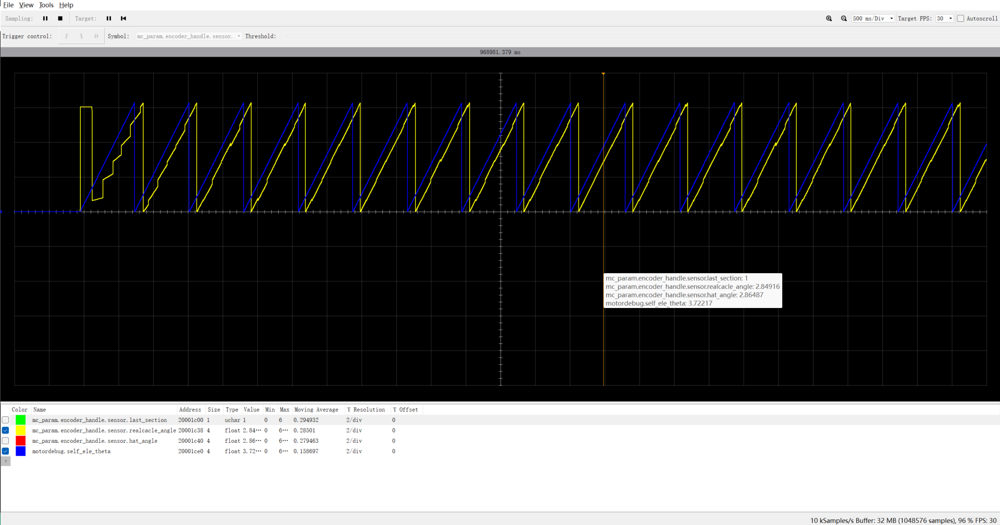
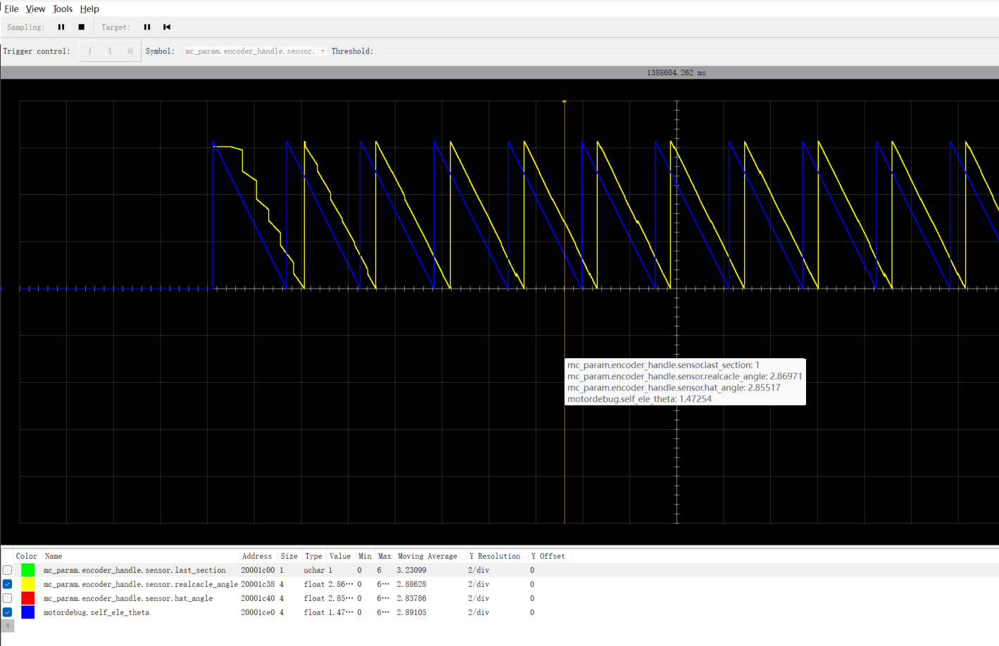
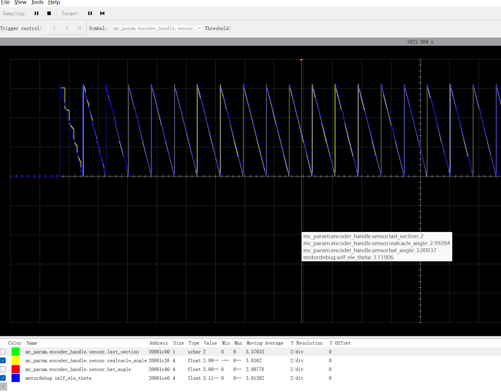
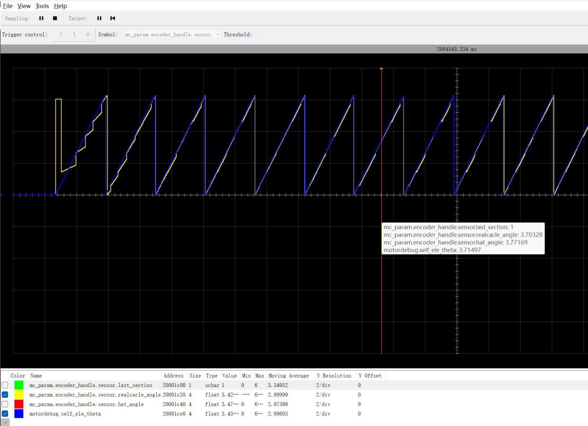
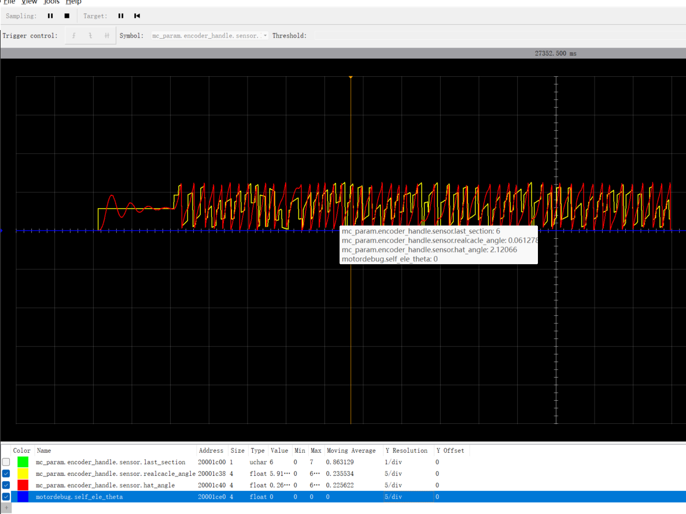
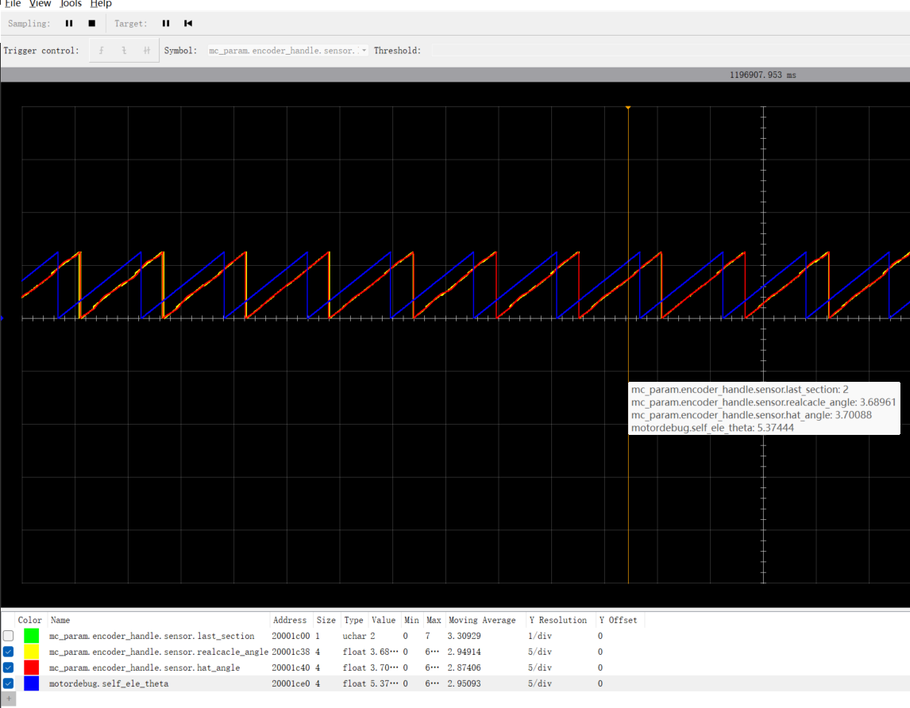
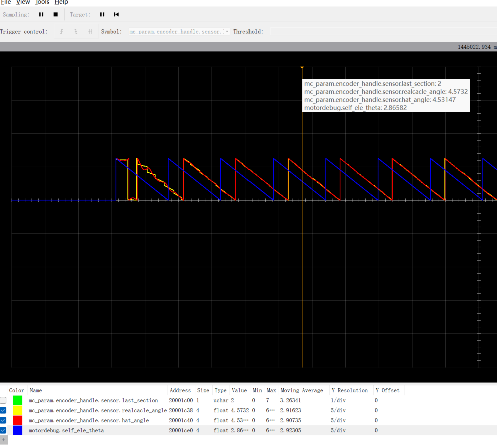
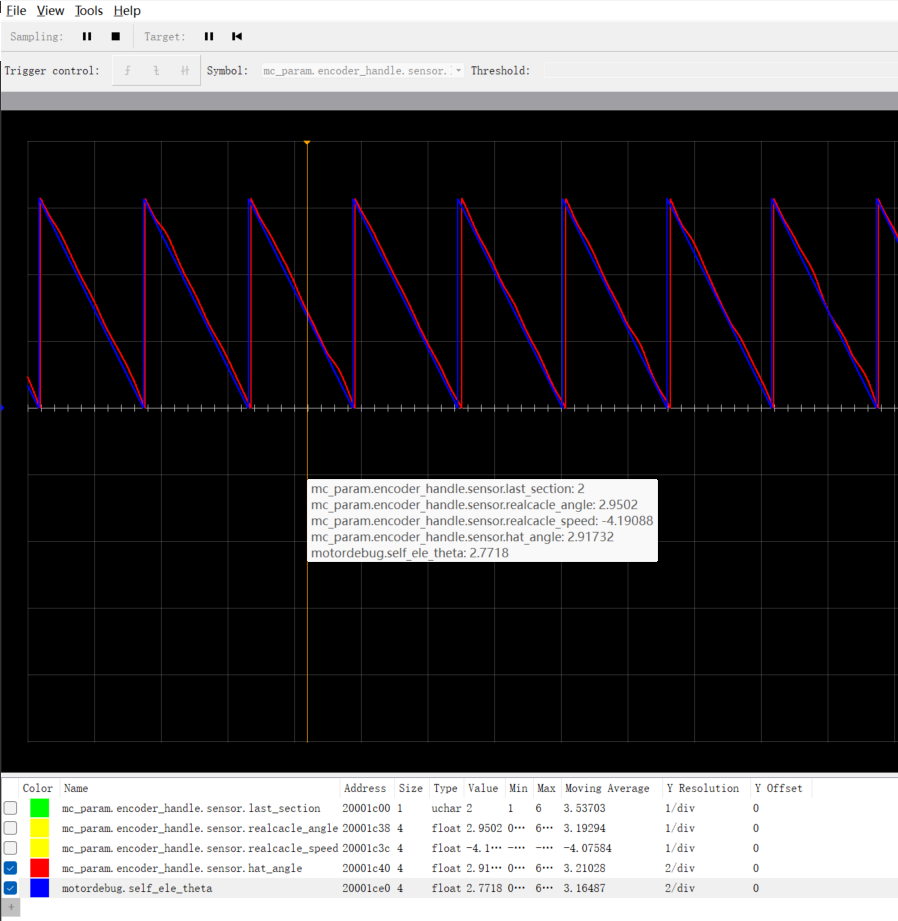
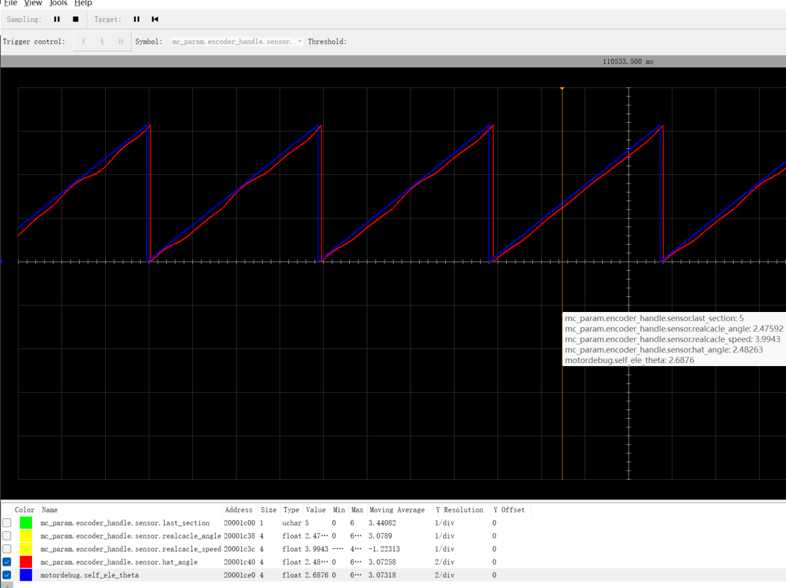

# HallSensor
## 1、基本原理
- n对极电机，每旋转一圈，产生n*6个跳变沿。将其进行组合，得到`6,4,5,1,3,2`
- 伪代码如下
```C
static uint8_t hall_get_sectionnumb(void)
{
    uint8_t u,v,w;
    u = HAL_GPIO_ReadPin(HALL_U1_GPIO_Port,HALL_U1_Pin);
    v = HAL_GPIO_ReadPin(HALL_V1_GPIO_Port,HALL_V1_Pin);
    w = HAL_GPIO_ReadPin(HALL_W1_GPIO_Port,HALL_W1_Pin);
    return u | (w<<1) | (v<<2);
}
```
- `人为规定`hall的扇区正向顺序:`645132`
### 如何得到该相序
- D轴>0,自给$\theta$值增加。使电机转动
- 读取hall信号
- 观察信号顺序，若顺序相反，调换线序/调整软件读取信号顺序，直至相同为止
## 获取跳变沿对应的角度
### 100us周期任务

## 调试过程记录
```
    #define OPENLOOP_DEBUG_TOTAL_Te             (0.04f)
    #define OPENLOOP_DEBUG_STEP_THETA           (0.0004f)

    #define SCETION_6_BASEANGLE   (5.005f)
    #define SCETION_4_BASEANGLE   (6.057f)
    #define SCETION_5_BASEANGLE   (0.648f)
    #define SCETION_1_BASEANGLE   (1.854f)
    #define SCETION_3_BASEANGLE   (2.898f)
    #define SCETION_2_BASEANGLE   (3.815f) 
```
### 情况一:正转
```
    #define HALL_POSITIVE_OFFSET (-0.0f)
    #define HALL_NEGATIVE_OFFSET (-0.0f)
```
- 波形图
    - self_theta领先cacle_theta (0.8)


### 情况二：反转
- 波形图 self_theta领先cacle_theta (1.4)


### 情况三：修改正负偏差，使其和自给角度重合
```
    #define HALL_POSITIVE_OFFSET (+0.8f)
    #define HALL_NEGATIVE_OFFSET (-1.4f)
```
- 波形图如下:
 

### 情况四：使能编码器自开环功能，观察现象
    - 电机抖动无法旋转


### 情况五：调整偏置值，是自给角度领先计算角度pi/2，再次使能编码器开环功能。
```
    #define HALL_POSITIVE_OFFSET (-0.75f)
    #define HALL_NEGATIVE_OFFSET (+0.4f)
```

 
- 使能编码器开环功能之后结果

|Uq|电源电流|速度|
|:--:|:--:|:--:|
|0.04f|0.06A|3.4|
|-0.04f|0.06A|3.7|
|0.1f|0.1A|12.7|
|-0.1f|0.12A|-11.79|
|0.2f|0.31A|26.37|
|-0.2f|0.40A|24.3|
|0.3f|0.65A|40.8|
|-0.3f|0.88A|37.4|
|0.4f|1.23A|50.0|
|-0.4f|1.55A|49.0|

### 情况六：调整偏置值，是自给角度领先计算角度pi/2/极对数，再次使能编码器开环功能。
```
    #define HALL_POSITIVE_OFFSET (+0.672f)
    #define HALL_NEGATIVE_OFFSET (-1.1f)
```
 

|Uq|电源电流|速度|
|:--:|:--:|:--:|
|0.1f|0.1A|原地抖动|
|-0.1f|0.12A|原地抖动|
|0.2f|0.31A|旋转抖动|
|-0.2f|0.40A|旋转抖动|

### 情况7：根据情况六，将偏置调到领先pi/2/极对数+0.2
```
    #define HALL_POSITIVE_OFFSET (+0.472f)
    #define HALL_NEGATIVE_OFFSET (-0.9f)
```
 

|Uq|电源电流|速度|
|:--:|:--:|:--:|
|0.1f|0.15A|旋转抖动|
|-0.1f|0.15A|旋转抖动|

### 情况8：根据情况7，将偏置调到领先pi/2/极对数+0.2+0.2
```
    #define HALL_POSITIVE_OFFSET (+0.272f)
    #define HALL_NEGATIVE_OFFSET (-0.7f)
```
- 情况同7

### 情况9：将偏置调到领先pi/2/极对数+0.2+0.2+0.2
```
    #define HALL_POSITIVE_OFFSET (+0.072f)
    #define HALL_NEGATIVE_OFFSET (-0.5f)
```
|Uq|电源电流|速度|备注|
|:--:|:--:|:--:|:--:|
|0.04f|0.06A|3.4||
|-0.04f|0.06A|3.7||
|0.1f|0.1A|14.7||
|-0.1f|0.12A|-14.5||
|0.2f|0.15|33.5|旋转过程中有抖动|

### 情况10：将偏置调到领先pi/2/极对数+0.2+0.2+0.3
```
    #define HALL_POSITIVE_OFFSET (-0.3f)
    #define HALL_NEGATIVE_OFFSET (-0.2f)
```
|Uq|电源电流|速度|备注|
|:--:|:--:|:--:|:--:|
|0.04f|0.05A|4.77||
|-0.04f|0.05A|-4.8||
|0.1f|0.06A|15.5||
|-0.1f|0.06A|-16.0||
|0.2f|0.09|32.6||
|-0.2f|0.09|-33.8||
|0.3f|0.12|50.9||
|-0.3f|0.12|-51.2||
|0.4f|||速度抖动严重|
|-0.4f|0.16|-68.2|速度轻微抖动，上电瞬间大电流，拉低电源|

## 对比总结
### 情况5和情况10
- 情况10的电机表现优于情况5


