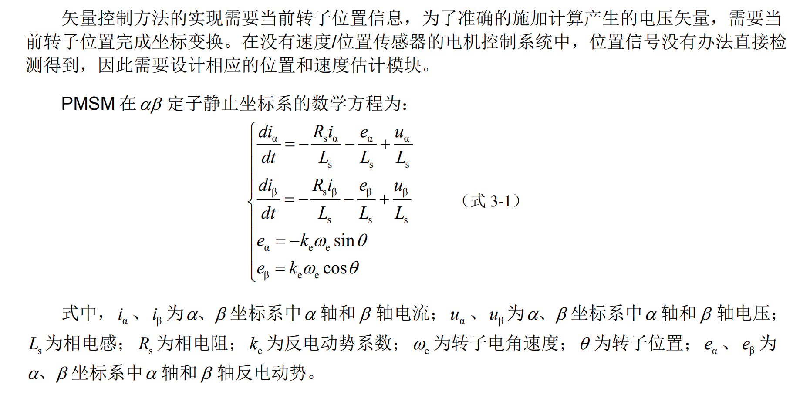
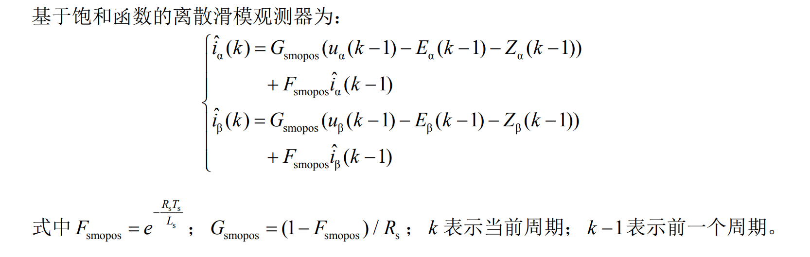

## TI SMO
- 参考文档
### alpha,beta坐标系下的数学模型


### 离散后的滑模公式


### 代码
```C
void ti_smo(void)
{
    /*	Sliding mode current observer	*/	
    smo.EstIalpha = smo.Fsmopos * smo.EstIalpha + smo.Gsmopos*(smo.Valpha - smo.Ealpha - smo.Zalpha);
    smo.EstIbeta  = smo.Fsmopos * smo.EstIbeta  + smo.Gsmopos*(smo.Vbeta  - smo.Ebeta -  smo.Zbeta);

    /*	Current errors	*/	
    smo.IalphaError = smo.EstIalpha - smo.Ialpha;
    smo.IbetaError = smo.EstIbeta - smo.Ibeta;

    /*  Sliding control calculator	*/																	
	smo.IalphaError = limit_value (smo.IalphaError, smo.E0, -smo.E0);
    smo.IbetaError  = limit_value (smo.IbetaError, smo.E0, -smo.E0);
    smo.Zalpha = smo.IalphaError * 2 * smo.Kslide;
    smo.Zbeta  = smo.IbetaError  * 2 * smo.Kslide;

    /*	Sliding control filter -> back EMF calculator	*/
    smo.Ealpha = smo.Ealpha + smo.Kslf * (smo.Zalpha - smo.Ealpha);
    smo.Ebeta = smo.Ebeta + smo.Kslf * (smo.Zbeta - smo.Ebeta);

    /*	Rotor angle calculator -> Theta = atan(-Ealpha,Ebeta)	*/	
    smo.Theta = atan2(-smo.Ealpha,  smo.Ebeta);

    while(smo.Theta>2*M_PI) smo.Theta-=2*M_PI;
    while(smo.Theta<0) smo.Theta+=2*M_PI;
}
```