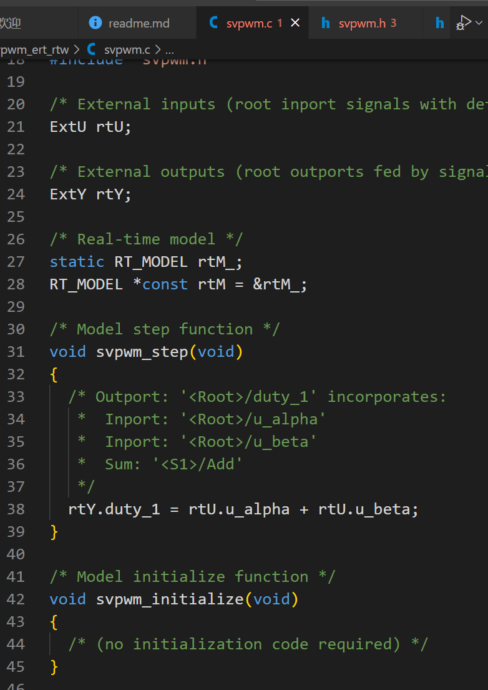

# 代码生成
## 模型建立
- 模型如下图
- 模型设置
    - 定步长
    - 步长:1e-6(值越小，仿真时间越长)
## 代码生成部分设置
- `硬件实现`选项
    - 设备供应商:NXP
    - 设备类型:Cotex-M4
- `代码生成`选项
    - 目标选择:ert.tlc  
    - 编译过程选择：仅生成代码
- `代码生成`-> `模版`选项
    - 取消`生成示例主程序`选项
## 生成代码


## 优化模型
- 优化目标，希望生成代码如下
```C
float svpwm(float alpha,float bete)
{
    return alpha + beta;
}
```

